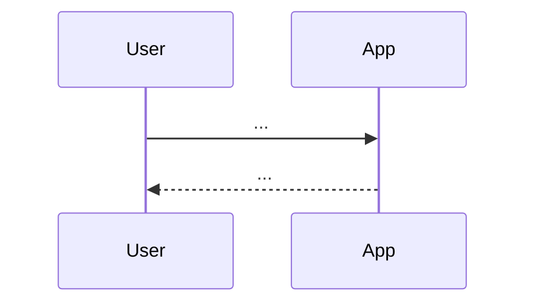

# Kiro Spec 工作流文档规范（design）

## 1. 目的
本规范用于统一 Kiro Specs 工作流中 `design.md`（设计规格）文档的**必备章节、表达方式与质量标准**，确保设计：
- 可实现（工程上可落地）
- 可评审（关键决策透明）
- 可追踪（能映射回 requirements 与 tasks）

## 2. 适用范围
- Kiro 三阶段 workflow 的 Design 阶段输出：`design.md`。
- 适用于涉及架构调整、数据流/接口变更、跨模块交互的改动。

## 3. 推荐目录与命名
- **建议位置**：`specs/<spec-name>/design.md`（仓库根目录）
- **引用规则**：设计章节应显式引用对应的需求编号 `R#`。

## 4. 设计文档的核心原则
- **需求驱动**：每个主要设计点应能回溯到某个 `R#`（或明确说明是为 NFR/约束）。
- **决策可解释**：对关键取舍（方案对比、为什么不用某方案）给出理由。
- **风险前置**：识别失败模式与回滚/降级策略。
- **可验证**：设计中应明确测试策略与可观测性。

## 5. 文档结构（必须）

### 5.1 概要（Summary）
- 这次设计要解决什么问题
- 范围边界（与 requirements 对齐）

### 5.2 需求映射（Requirements Mapping）
- 列出 `R#` → 设计要点 的映射表（或逐条说明）

### 5.3 架构与组件（Architecture / Components）
- 组件边界与职责（谁负责什么）
- 数据/控制流（请求从哪进、怎么走、从哪出）

### 5.4 关键流程（Sequence / Flows）
Kiro 官方建议在 design 阶段记录 **sequence diagrams** 与组件交互。
- 每个关键用户路径至少 1 条流程
- 覆盖异常流程（鉴权失败、依赖超时、数据校验失败）

### 5.5 数据设计（Data Model / Storage）（如适用）
- 数据结构/表/索引
- 迁移策略（向前兼容/回滚）

### 5.6 API / 接口契约（如适用）
- 请求/响应结构
- 错误码/错误模型
- 版本策略

### 5.7 安全、性能、可靠性（NFR）
- 鉴权与授权
- 幂等/重试/超时
- 性能目标与容量预估

### 5.8 可观测性（Observability）
- 关键日志
- 指标与告警
- 链路追踪（如适用）

### 5.9 测试策略（Testing Strategy）
- 单元/集成/E2E 的覆盖范围
- 边界条件与回归点
- 性质测试（PBT）建议：Kiro 提到可从 EARS 需求提取可逻辑测试的性质，并在执行阶段生成大量随机用例进行验证（可选但推荐）。

### 5.10 迁移与发布（Rollout / Migration）
- Feature flag / 灰度
- 回滚策略
- 数据迁移步骤

### 5.11 未决问题（Open Questions）
- 需要产品/工程进一步澄清的点

## 6. 图与表示法建议
- **Mermaid**：建议用 Mermaid 表达 sequence / flow / state。
- 图要**可读**：配套文字说明输入/输出、异常路径、关键数据。

## 7. 迭代规则
参考 Kiro best practices：需求或设计更新时，应同步更新任务列表。
- 更新 requirements 后：允许直接修改 `requirements.md`，或在 spec session 中让 Kiro补充。
- 更新 design 后：建议通过 refine 使 design 与 tasks 同步。
- 更新 tasks：通过 update tasks 生成/对齐新任务。

## 8. 评审清单（Definition of Done）
- **可追踪性**：核心章节能映射到 `R#`。
- **可实现性**：关键接口、数据、流程定义明确。
- **异常完备**：至少覆盖主要失败模式。
- **测试可落地**：明确测试边界与回归策略。
- **可运维**：有最基本的可观测性与发布/回滚策略。

## 9. 模板（可直接复制到 `specs/<spec-name>/design.md`）

```markdown
# <Spec 名称> - Design

## Summary

## Requirements Mapping
- R1: ...
- R2: ...

## Architecture / Components

## Key Flows (Sequence)


## Data Model / Storage

## API / Interfaces

## NFR (Security/Performance/Reliability)

## Observability

## Testing Strategy

## Rollout / Migration

## Open Questions
```

## 10. 参考
- https://kiro.dev/docs/specs/concepts/
- https://kiro.dev/docs/specs/best-practices/
- https://kiro.dev/docs/specs/correctness/
